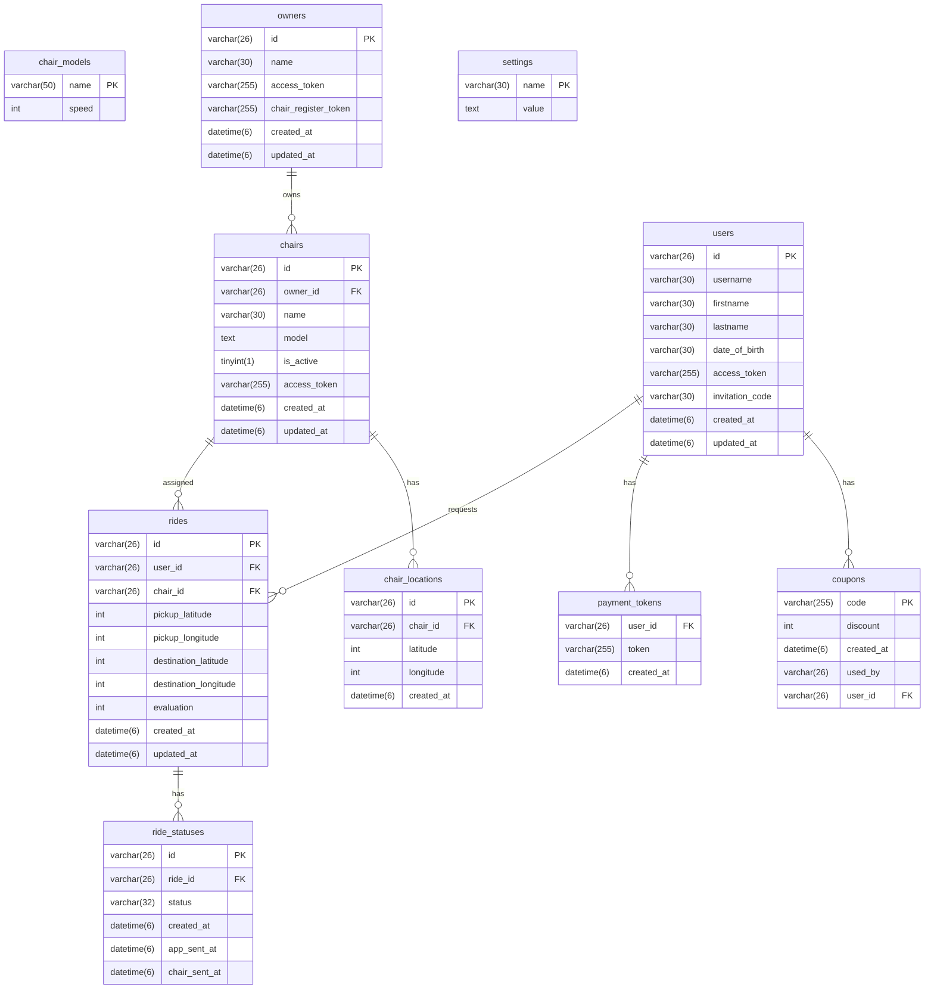

```mermaid
erDiagram
	chair_locations {
		varchar(26) id PK
		varchar(26) chair_id FK
		int latitude
		int longitude
		datetime(6) created_at
	}

	chair_models {
		varchar(50) name PK
		int speed
	}

	chairs {
		varchar(26) id PK
		varchar(26) owner_id FK
		varchar(30) name
		text model
		tinyint(1) is_active
		varchar(255) access_token
		datetime(6) created_at
		datetime(6) updated_at
	}

	coupons {
		varchar(255) code PK
		int discount
		datetime(6) created_at
		varchar(26) used_by
		varchar(26) user_id FK
	}

	owners {
		varchar(26) id PK
		varchar(30) name
		varchar(255) access_token
		varchar(255) chair_register_token
		datetime(6) created_at
		datetime(6) updated_at
	}

	payment_tokens {
		varchar(26) user_id FK
		varchar(255) token
		datetime(6) created_at
	}

	ride_statuses {
		varchar(26) id PK
		varchar(26) ride_id FK
		varchar(32) status
		datetime(6) created_at
		datetime(6) app_sent_at
		datetime(6) chair_sent_at
	}

	rides {
		varchar(26) id PK
		varchar(26) user_id FK
		varchar(26) chair_id FK
		int pickup_latitude
		int pickup_longitude
		int destination_latitude
		int destination_longitude
		int evaluation
		datetime(6) created_at
		datetime(6) updated_at
	}

	settings {
		varchar(30) name PK
		text value
	}

	users {
		varchar(26) id PK
		varchar(30) username
		varchar(30) firstname
		varchar(30) lastname
		varchar(30) date_of_birth
		varchar(255) access_token
		varchar(30) invitation_code
		datetime(6) created_at
		datetime(6) updated_at
	}

	chairs ||--o{ chair_locations : has
	owners ||--o{ chairs : owns
	users ||--o{ coupons : has
	users ||--o{ payment_tokens : has
	rides ||--o{ ride_statuses : has
	chairs ||--o{ rides : assigned
	users ||--o{ rides : requests
```
